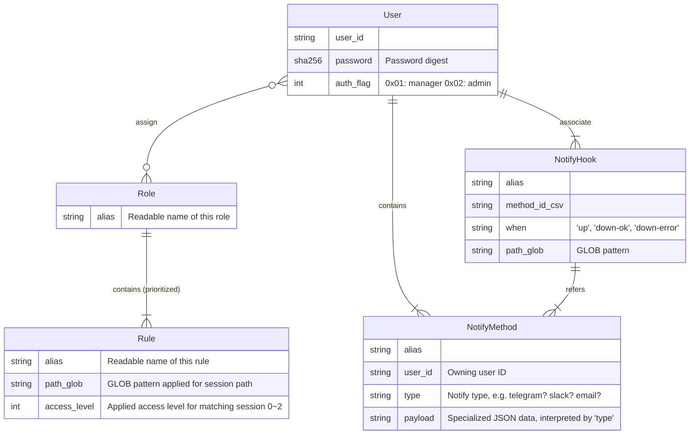

# Config-it-Access

Centralized configuration management system

# Design Note

- The `Source` mandates all authorities of configurations to `Relay`
  - There are 3 levels of access: `View` / `Modify` / `Admin`
  - Each levels are assigned to each storage, with own key string
  - Only admin can browse the debug trace output of the program
- `Relay` requires apikey for `Source` registration
- `Source` registers itself to `Relay` during runtime
  - `Source` registers its path, such as `a/b.c/d`
  - `Relay` set `Source Rule`, which are applied to path pattern (simple GLOB)
  - `Source Rule` defines access level
    - Rule `MyRule` has `Admin` access to `Sources` with path `my_site/**`
    - `Source Rule` can be assigned to each `Root User`
    - `User` may assigned to another `Root User`
- Each path for `Source` is unique and consistent
  - Every log trace will be recorded
  - Any edition / access will be recorded

## `Source <-> Relay`

- `SRC --> REL` : Register & Open `SSE` Recv
- `SRC --> REL` : Status Update (CPU / Memory / NET usage, etc ...)
- `SRC --> REL` : Property Register & UPDATE & DELETE
- `SRC --> REL` : Upload Log & Trace
- `SRC <-- REL` : `SSE` Update Config

## `Relay <-> Client`

### Access Management

- `CLI >-> REL` : Login ID/PW
  - Session ID -> Use it for Access
- `CLI >-> REL` : Admin : User Authority Control
- `CLI >-> REL` : Admin : Access Rule Management
  - e.g. `sites/seoul/base/**` -> `Role::Admin`, `sites/seoul/
- `CLI >-> REL` : Manager : User <-> Rule(s) Binding
- `CLI >-> REL` : Manager : User Create / Delete

### Browse

- `CLI >-> REL` : Fetch Session List (Id, Path, State)
- `CLI >-> REL` : Fetch Session Details
- `CLI --> REL` : Open Session Monitor `SSE` Recv
- `CLI <-- REL` : Props, Prop Updates, Log, Trace
- `CLI >-> REL` : Fetch unknown trace ID / Older log-traces
- `CLI --> REL` : Commit property update

# Modelling



- Fetching example

  ```python
  def on_session_event(event_type: str, path: str):
    noti = db.query(
      "SELECT methods FROM NotifyHook"
      "  WHERE when = {event_type}"
      "    AND path_glob GLOB {path}")

    # methods => 'a,b,c,d,...'
    methods = [n[0] for n in noti].join(',')
    destinations = db.query(
      "SELECT user_id, type, payload FROM NotifyMethod "
      "  WHERE id IN ({methods})")

    dedup_by_user_id(destinations)
  ```
